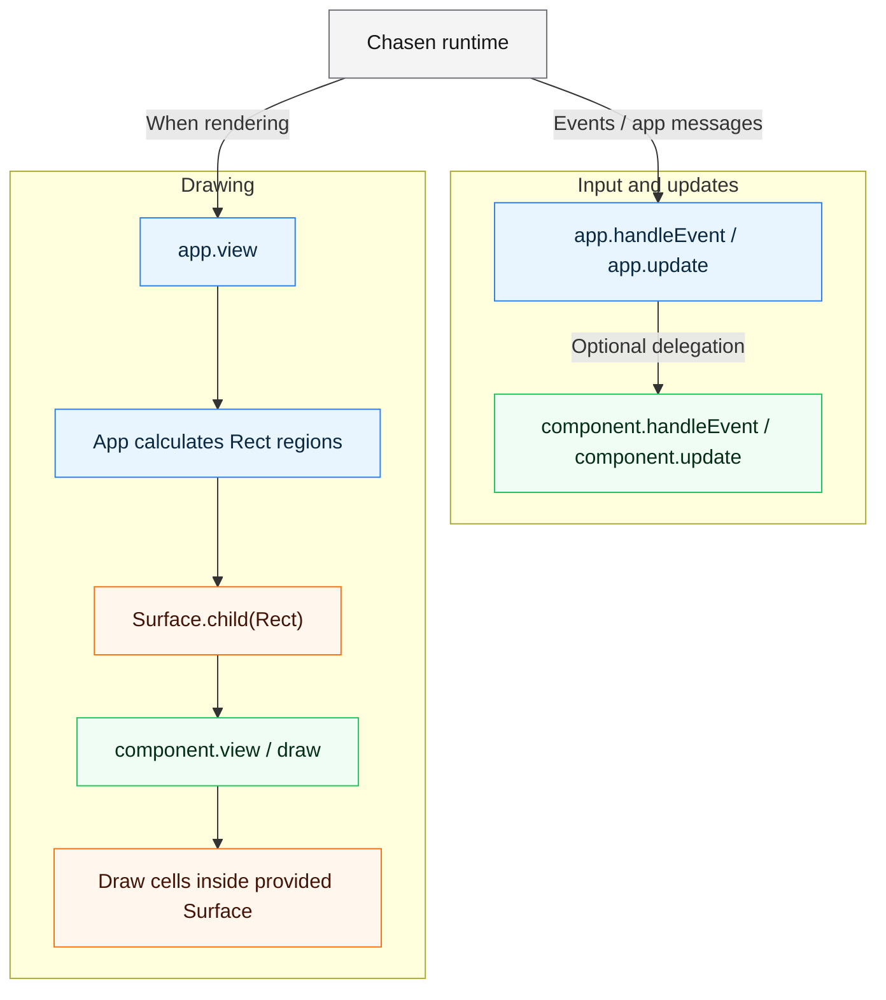

# chasen-ui

chasen-ui is a small UI primitives package for
[Chasen](https://github.com/hiroaqii/chasen) terminal applications.

The Zig module name is `chasen_ui`.

## What chasen-ui Is

Chasen core provides the runtime: terminal setup, event loop, typed messages,
runtime effects, and immediate cell drawing through `Surface`.

chasen-ui builds on that core with reusable input behavior, drawing components,
and layout and text helpers. Applications compose these pieces by passing
app-positioned child surfaces to components.

The package is intentionally small. Applications own their semantic state,
screen structure, layout policy, event routing, and visual design. Components
may retain local interaction state, but do not take over those responsibilities.

See [Components and Guides](#components-and-guides) for the available APIs and
their usage guides.

## What chasen-ui Is Not

chasen-ui is not a retained widget framework.

It intentionally does not provide:

- an automatic layout engine
- a retained component tree
- a global theme system
- a router or screen manager
- implicit focus ownership for the whole app
- a full desktop-style widget toolkit

The usual pattern is: the app decides where something belongs, creates a child
`Surface`, and asks a chasen-ui component or helper to draw inside that clipped
region.

## Requirements

- Zig **0.16.0**, as declared by `minimum_zig_version`.

## Installation

From your application's Zig project:

```sh
zig fetch --save git+https://github.com/hiroaqii/chasen-ui.git
```

Add the dependency to `build.zig`. This complete example builds `src/main.zig`.
Obtain Chasen from the UI dependency so the application and components use the
same Chasen module:

```zig
const std = @import("std");

pub fn build(b: *std.Build) void {
    const target = b.standardTargetOptions(.{});
    const optimize = b.standardOptimizeOption(.{});
    const ui_dep = b.dependency("chasen_ui", .{
        .target = target,
        .optimize = optimize,
    });
    const chasen_dep = ui_dep.builder.dependency("chasen", .{
        .target = target,
        .optimize = optimize,
    });
    const exe = b.addExecutable(.{
        .name = "ui-demo",
        .use_llvm = true,
        .use_lld = if (target.result.os.tag == .linux) true else null,
        .root_module = b.createModule(.{
            .root_source_file = b.path("src/main.zig"),
            .target = target,
            .optimize = optimize,
            .imports = &.{
                .{ .name = "chasen", .module = chasen_dep.module("chasen") },
                .{ .name = "chasen_ui", .module = ui_dep.module("chasen_ui") },
            },
        }),
    });
    b.installArtifact(exe);
}
```

The main `chasen_ui` module depends on Chasen. For the optional
`chasen_ui_graphics` module, see [Loading Indicators](docs/LOADING_INDICATORS.md).
The package build currently resolves graphics and animation dependencies even
when the application imports only `chasen_ui`; the main source module does not
import either package.

## How It Fits With Chasen

Chasen calls the app's input/update callbacks and decides when to call `view`.
The app chooses which components receive input and where they draw. This diagram
shows those responsibilities, rather than a complete runtime event sequence.



- Chasen owns terminal setup, event delivery, redraw decisions, and rendering.
- The app owns component instances, event routing, and screen policy.
- chasen-ui provides reusable input/update behavior and drawing inside supplied surfaces.

See [Component Model](docs/COMPONENTS.md#component-model) for message mapping,
redraw behavior, and state and text lifetimes.

## Basic Usage

The app creates a region and passes that region to a component. Components draw
inside the surface they receive; they do not decide their own screen position.

Save this as `src/main.zig`, then run `zig build` and
`./zig-out/bin/ui-demo` in an interactive terminal. Press Esc to quit.

```zig
const std = @import("std");
const chasen = @import("chasen");
const ui = @import("chasen_ui");

const App = struct {
    pub const Msg = union(enum) {
        pub const undelivered_policy = .plain;

        quit,
    };

    pub fn handleEvent(self: *const App, event: chasen.Event) ?Msg {
        _ = self;
        return switch (event) {
            .key_press => |key| if (key.matches(chasen.Key.escape, .{})) .quit else null,
            else => null,
        };
    }

    pub fn update(self: *App, msg: Msg, ctx: *chasen.Ctx(Msg)) !void {
        _ = self;
        switch (msg) {
            .quit => ctx.quit(),
        }
    }

    pub fn view(self: *const App, surface: *chasen.Surface) !void {
        _ = self;
        surface.clearAll();

        // The app decides placement. This Rect is relative to the root surface.
        var panel_area = surface.child(.{
            .col = 2,
            .row = 2,
            .width = 48,
            .height = 10,
        });

        // Panel draws only border chrome and exposes the inner content surface.
        const frame = ui.Panel.frame(&panel_area, .{
            .title = "chasen-ui",
            .padding = .{ .top = 1, .right = 2, .bottom = 1, .left = 2 },
            .border = .rounded,
        });
        frame.view();

        var content = frame.contentSurface();
        _ = content.borrowTextAt(0, 0, "Components draw inside app-owned regions.", .{});
        _ = content.borrowTextAt(0, 2, "Esc: quit", .{ .fg = .gray });
    }
};

pub fn main(init: std.process.Init) !void {
    try chasen.run(init, App{});
}
```

## Components and Guides

| Area | Examples | Guide |
| --- | --- | --- |
| Input | `TextInput`, `TextArea`, `Select`, `Checkbox`, `Radio`, `Button` | [Components](docs/COMPONENTS.md#input) |
| Navigation | `ListViewport`, `ColumnList`, `BlockViewport`, `FocusList` | [Lists and navigation](docs/COMPONENTS.md#lists-and-navigation) |
| Structure | `Panel`, `Overlay`, `Modal`, `Box`, `Table`, `Tree` | [Structure](docs/COMPONENTS.md#structure) |
| Display | `Paragraph`, `StatusLine`, `Spinner`, `Badge`, `key_hint` | [Display](docs/COMPONENTS.md#display) |
| Layout | `Rect` splitting, padding, grids, and stacks | [Layout and child surfaces](docs/LAYOUT.md) |
| Text | `text_projection`, `text_presentation` | [Text geometry](docs/COMPONENTS.md#text-geometry-and-presentation) |
| Optional graphics | `chasen_ui_graphics.LoadingIndicator` | [Loading indicators](docs/LOADING_INDICATORS.md) |

Applications own semantic state and route events into component updates.
Components can retain local state, but do not own the runtime or the whole app's
focus. Borrowed text must remain valid while retained and through terminal
rendering; use frame-owned copies for text generated during `view`.

## Recommended Starting Examples

From the `chasen-ui` checkout, run `zig build run-<name>`:

| Example | Demonstrates |
| --- | --- |
| `layout_helpers` | Calculate rectangles and create child surfaces |
| `panel` | Frame and app-owned content |
| `column_list` | Table-like list rows |
| `block_viewport` | Variable-height scrolling |
| `overlay` | Popup foreground UI |
| `text_input` | Editable input state |
| `settings` | Compose several primitives |
| `loading_indicators` | Spinner presets and optional multiline indicators |

```sh
zig build run-panel
zig build check-examples
zig build --help
```

The loading gallery uses `chasen_graphics` and `chasen_anim`. Its controls,
sizes, and timing policy are in [Loading Indicators](docs/LOADING_INDICATORS.md).

## Development

```sh
zig build test
zig build check-panel
zig build check-examples
```

See [Development](docs/DEVELOPMENT.md) for focused test commands, optional
example dependencies, and the source map. Dependencies are fetched from the public
Git URLs pinned in `build.zig.zon`; no sibling checkouts are required.

## License

See [LICENSE](LICENSE).
