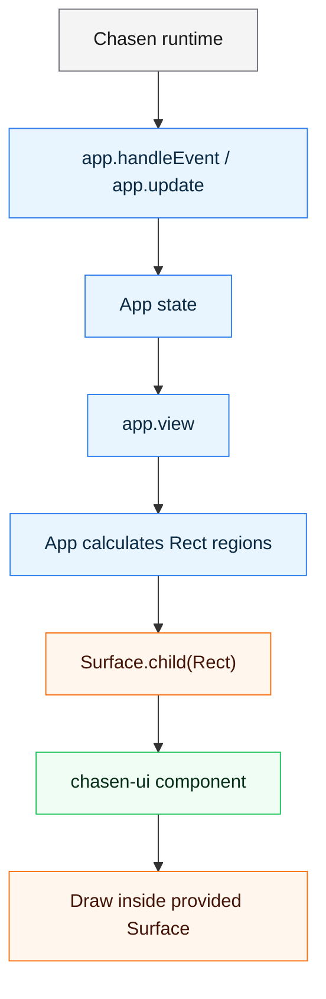

# chasen-ui

chasen-ui is a small UI primitives package for
[Chasen](https://github.com/hiroaqii/chasen) terminal applications.

The Zig module name is `chasen_ui`.

## What chasen-ui Is

Chasen core provides the runtime: terminal setup, event loop, typed messages,
runtime effects, and immediate cell drawing through `Surface`.

chasen-ui sits on top of that core. It provides reusable UI pieces that are
useful when an app starts to grow beyond direct `Surface` drawing:

- input components such as `TextInput`, `TextArea`, `Checkbox`, and `Select`
- structure components such as `Panel`, `Overlay`, `Modal`, `Box`, and `Table`
- navigation helpers such as `ListViewport`, `ColumnList`, and `BlockViewport`
- display helpers such as `Paragraph`, `StatusLine`, `Help`, `Badge`, and
  `Spinner`
- small layout helpers for calculating `Rect` values

The package is intentionally small. Applications still own their state, screen
structure, layout policy, event routing, and visual design.

## What chasen-ui Is Not

chasen-ui is not a retained widget framework.

It intentionally does not provide:

- an automatic layout engine
- a retained component tree
- a global theme system
- a router or screen manager
- implicit focus ownership for the whole app
- a full desktop-style widget toolkit

The usual pattern is: the app decides where something belongs, creates a child
`Surface`, and asks a chasen-ui component or helper to draw inside that clipped
region.

## How It Fits With Chasen



This keeps ownership explicit:

- Chasen owns the terminal runtime.
- The app owns state and screen policy.
- chasen-ui owns small reusable drawing and input behavior.

## Basic Usage

The app creates a region and passes that region to a component. Components draw
inside the surface they receive; they do not decide their own screen position.

```zig
const std = @import("std");
const chasen = @import("chasen");
const ui = @import("chasen_ui");

const App = struct {
    pub const Msg = union(enum) {
        quit,
    };

    pub fn handleEvent(self: *const App, event: chasen.Event) ?Msg {
        _ = self;
        return switch (event) {
            .key_press => |key| if (key.matches(chasen.Key.escape, .{})) .quit else null,
            else => null,
        };
    }

    pub fn update(self: *App, msg: Msg, ctx: *chasen.Ctx(Msg)) !void {
        _ = self;
        switch (msg) {
            .quit => ctx.quit(),
        }
    }

    pub fn view(self: *const App, surface: *chasen.Surface) !void {
        _ = self;
        surface.clearAll();

        // The app decides placement. This Rect is relative to the root surface.
        var panel_area = surface.child(.{
            .col = 2,
            .row = 2,
            .width = 48,
            .height = 10,
        });

        // Panel draws only border chrome and exposes the inner content surface.
        const frame = ui.Panel.frame(&panel_area, .{
            .title = "chasen-ui",
            .padding = .{ .top = 1, .right = 2, .bottom = 1, .left = 2 },
            .border = .rounded,
        });
        frame.view();

        var content = frame.contentSurface();
        _ = content.borrowTextAt(0, 0, "Components draw inside app-owned regions.", .{});
        _ = content.borrowTextAt(0, 2, "Esc: quit", .{ .fg = .gray });
    }
};

pub fn main(init: std.process.Init) !void {
    try chasen.run(init, App{});
}
```

## Component Model

Display-only components draw the values the app gives them.

Examples:

- `Label`
- `Badge`
- `Divider`
- `Paragraph`
- `StatusLine`
- `Help`
- `Table`

Interactive components may hold local component state, but the app still owns
event routing and decides how component messages affect app state.

Examples:

- `TextInput`
- `TextArea`
- `PasswordInput`
- `NumberInput`
- `Select`
- `Checkbox`
- `Radio`
- `Button`

The common flow mirrors Chasen apps:

```text
app handleEvent -> component handleEvent -> app Msg -> app update -> component update
```

Display-only components use the simpler shape:

```text
app view -> component view/draw
```

Borrowed labels, placeholders, rows, frame lists, and other borrowed values must
outlive the component or the current render call that uses them. Use Chasen's
frame allocator or owned app state when generated text must live through a
render.

## Layout Ownership

chasen-ui components do not carry placement fields such as `col`, `row`,
`width`, or `height`.

The layout vocabulary is small:

```text
Rect
  = position + size inside a Surface

ui.layout
  = helpers that calculate Rect values

Surface
  = drawing target

Surface.child(Rect)
  = clipped child Surface for that Rect

chasen-ui component
  = draws inside the Surface it receives
```

In a typical `view`, the app calculates rectangles, creates child surfaces from
those rectangles, and passes the child surfaces to components.

The application calculates layout and creates clipped child surfaces:

```zig
const body_rect = chasen.Rect{
    // Start 2 terminal cells from the left edge of the parent surface.
    .col = 2,
    // Start 4 terminal cells from the top edge of the parent surface.
    .row = 4,
    // Reserve 60 terminal cells horizontally.
    .width = 60,
    // Reserve 12 terminal cells vertically.
    .height = 12,
};

var body = surface.child(body_rect);
```

For simple screens, writing `Rect` values directly is fine. For larger screens,
use `ui.layout` to calculate regions:

```text
Root Surface
┌────────────────────────────────────────────┐
│ header                                     │
├──────────────┬─────────────────────────────┤
│ sidebar      │ content                     │
│              │                             │
│              │                             │
├──────────────┴─────────────────────────────┤
│ footer                                     │
└────────────────────────────────────────────┘

ui.layout computes the Rect values above.

header_rect  -> Surface.child(header_rect)
sidebar_rect -> Surface.child(sidebar_rect)
content_rect -> Surface.child(content_rect)
footer_rect  -> Surface.child(footer_rect)

ui.Panel / ui.Table / ui.Paragraph / ...
  -> draw inside those child surfaces
```

The same idea in code:

```zig
// Start with a Rect that covers the entire current surface.
const root = chasen.Rect{
    .col = 0,
    .row = 0,
    .width = surface.size().width,
    .height = surface.size().height,
};

// takeTop returns the top band in `.taken` and the remaining area in `.rest`.
const header = ui.layout.takeTop(root, 1);
// Continue splitting the remaining area. Nothing has been drawn yet.
const footer = ui.layout.takeBottom(header.rest, 1);
const sidebar = ui.layout.takeLeft(footer.rest, 18);
const content = sidebar.rest;

// Turn each Rect into a clipped drawing target.
var header_surface = surface.child(header.taken);
var sidebar_surface = surface.child(sidebar.taken);
var content_surface = surface.child(content);
var footer_surface = surface.child(footer.taken);

// Drawing at 0,0 is now local to each child surface.
_ = header_surface.borrowTextAt(0, 0, "Header", .{ .bold = true });
_ = sidebar_surface.borrowTextAt(0, 0, "Navigation", .{});
_ = content_surface.borrowTextAt(0, 0, "Main content", .{});
_ = footer_surface.borrowTextAt(0, 0, "Esc: quit", .{ .fg = .gray });
```

Common layout helpers include:

- `inset`: shrink a rectangle by padding values
- `takeTop`: split a top band from a rectangle
- `takeBottom`: split a bottom band from a rectangle
- `takeLeft`: split a left band from a rectangle
- `takeRight`: split a right band from a rectangle
- `center`: create a centered rectangle
- `columns`: split a rectangle into equal-width columns
- `rows`: split a rectangle into equal-height rows
- `fixedGrid`: split a rectangle into fixed rows and columns
- `stack`: place fixed-height rows with gaps

The layout helpers only calculate rectangles. They do not render and they do
not own component state.

## Choosing Components

### Input

Use input components when the app needs editable state:

- `TextInput`
- `TextArea`
- `PasswordInput`
- `NumberInput`
- `Select`
- `Checkbox`
- `Radio`
- `Button`
- `FormField`

### Lists and Navigation

Use these when the app owns collections, focus, filtering, or scroll state:

- `Viewport`: offset clamp and visible range helper for fixed-size collections
- `ListViewport`: visible range and focus visibility for fixed-height rows
- `ListFilter`: small filter state helper for app-owned lists
- `ColumnList`: table-like list rows with per-column styling and alignment
- `BlockViewport`: scrollable content made of variable-height blocks
- `FocusList`: fixed-length focus state for app-owned event routing
- `List`
- `SelectableList`
- `MultiSelectList`
- `Menu`
- `Tabs`
- `Breadcrumbs`
- `Accordion`

### Structure

Use these to frame, layer, or group content:

- `Panel`
- `Overlay`
- `Modal`
- `Box`
- `Table`
- `Tree`

### Display

Use these for display-only UI:

- `Paragraph`
- `StatusLine`
- `Help`
- `MessageBlock`
- `Spinner`
- `ProgressBar`
- `Gauge`
- `Toast`
- `Rating`
- `Badge`
- `Alert`
- `Divider`
- `Label`

## Recommended Starting Examples

The examples are intentionally small and component-specific. Start with these:

- `layout_helpers`: calculate `Rect` values and create child surfaces
- `panel`: draw a frame and compose app-owned content inside it
- `column_list`: draw table-like list rows
- `block_viewport`: scroll variable-height blocks
- `overlay`: draw popup-style foreground UI
- `text_input`: handle editable input state
- `settings`: compose several primitives into a small screen

Run an example from this package:

```sh
zig build run-panel
```

Use the example directory name after `run-`, for example:

```sh
zig build run-layout_helpers
zig build run-column_list
zig build run-block_viewport
zig build run-overlay
zig build run-text_input
zig build run-settings
```

Build all examples, or list all available build steps:

```sh
zig build check-examples
zig build --help
```

## Component Catalog

### Input

- `TextInput`
- `TextArea`
- `PasswordInput`
- `NumberInput`
- `Select`
- `Checkbox`
- `Radio`
- `Button`
- `FormField`

### Navigation

- `FocusList`
- `Viewport`
- `List`
- `ListViewport`
- `ListFilter`
- `ColumnList`
- `SelectableList`
- `MultiSelectList`
- `Menu`
- `Tabs`
- `Breadcrumbs`
- `Accordion`
- `BlockViewport`

### Structure

- `Box`
- `Panel`
- `Modal`
- `Overlay`
- `Table`
- `Tree`

### Display

- `Spinner`
- `ProgressBar`
- `Gauge`
- `Toast`
- `Rating`
- `Badge`
- `Alert`
- `Divider`
- `Label`
- `Paragraph`
- `StatusLine`
- `Help`
- `MessageBlock`

## Development

Source files are grouped by component role:

```text
src/input
src/navigation
src/display
src/structure
```

`src/root.zig` re-exports the public API, so callers can use top-level names
such as `ui.TextInput`, `ui.Panel`, and `ui.Table`.

Run tests:

```sh
zig build test
```

Build one example without running it:

```sh
zig build check-panel
```

Individual example build steps use the same name as run steps with
`check-<name>`.
